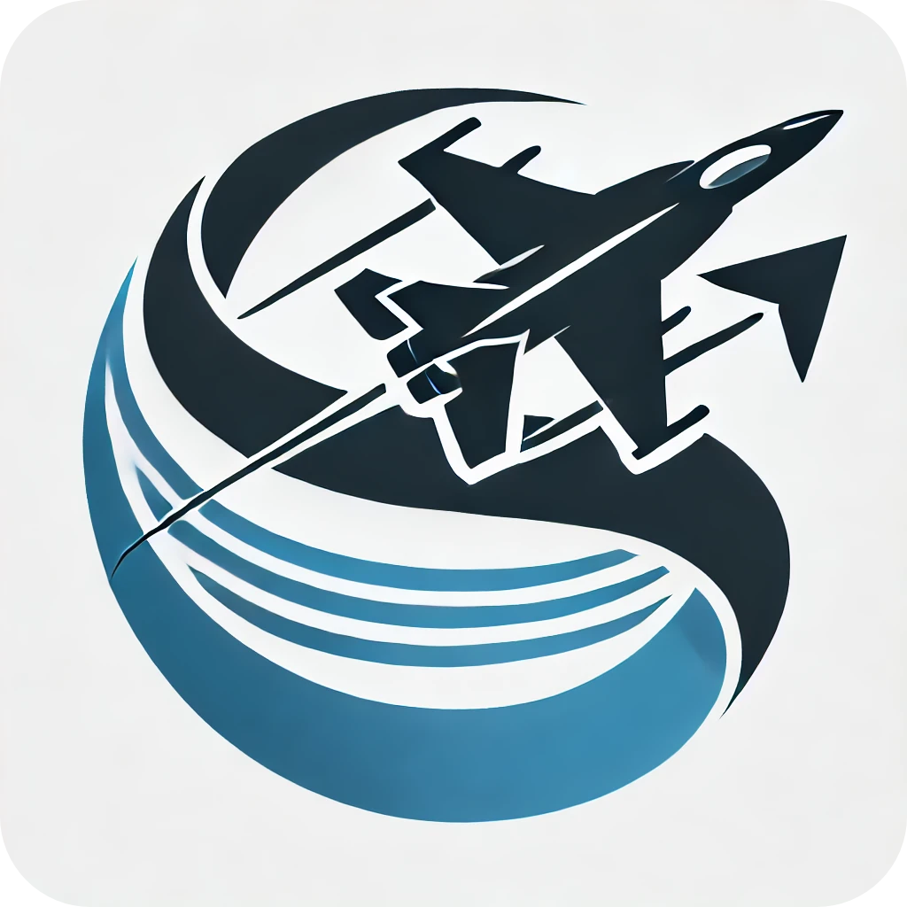

  
  <h1 align="center">SLAM</h1>
  <h1 align="center">SymLink Advanced Mod-manager for DCS</h1>

---

| 📥 Download | ⚙️ Installation |
|---------------------------------------------|---------------------------------------------|
| [Releases](https://github.com/halfmanbear/SLAM/releases/) | [Wiki](https://github.com/halfmanbear/SLAM/wiki) |

---

## Overview

SLAM (SymLink Advanced Mod-manager) is a PowerShell-based mod management tool designed for DCS (Digital Combat Simulator) World. It leverages symbolic links to manage mods more efficiently, providing a seamless way to install, uninstall, and toggle mods without the need to move files around. This ensures that your original mod files remain untouched, and any changes made in-game are directly reflected in the linked files.

## Features

- **Space Saving:** Symbolic links create a direct reference to the mod files, reducing disk space usage and improving performance.
- **Minimized SSD Degradation:** Fewer reads/writes are performed, leading to less degradation of SSDs.
- **Efficient Mod Management:** Easily install, uninstall, and toggle mods using symbolic links.
- **Automatic Backup:** Automatically backs up DCS files before creating symbolic links to mods, ensuring you can easily revert to the original game state if needed.
- **Persistent Mod Files:** Uses symbolic links to ensure any edits made in-game are directly reflected and retained in the mod files.
- **Simple Configuration:** Uses a single `config.txt` file to specify the game install location.
- **User-Friendly Interface:** Command-line interface guides you through selecting games and mods.

## Contributing

We welcome contributions to SLAM. Please feel free to submit issues, fork the repository, and create pull requests.  

If you find SLAM useful, consider supporting its development through [GitHub Sponsors](https://github.com/sponsors/halfmanbear) or [Buy Me a Coffee](https://www.buymeacoffee.com/halfmanbear).

## Acknowledgements

- Inspired by the need for efficient and user-friendly mod management for DCS World.
- Thanks to the DCS community for their continuous support and feedback.

---

Happy Modding!
